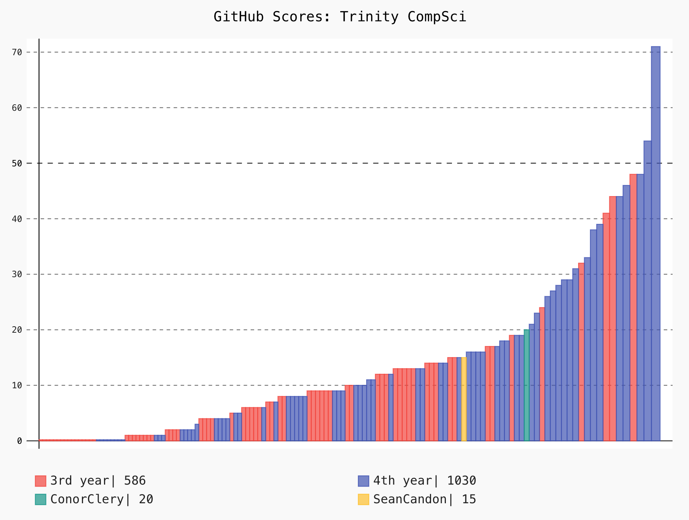

# TCD-CS-GithubScores

GithubScore = (accumulation of star_gazers on your repos) + (your follower count)

This graph was generated with the command, "python data_visual.py KohnOhgOhlayOrah LukeHackett12"

This graph was generated with the command, "python data_visual.py ConorClery SeanCandon"

These commands generate up-to-date graphs that dipict student engagement on the popular version control webservice, GitHub.
The program is run from the command line and generates an svg file which can be viewed with a web browser.

Although there were many more features I would have liked to have added--mostly to depict growth over time--and which I considered in my design, ultimately I am quite happy with the core functionality.

